# ADK-TS Framework Architecture

Welcome to the Agent Development Kit (ADK) TypeScript implementation! This guide will help you understand the framework architecture to contribute effectively to the project.

```mermaid
graph TB
    %% User Layer
    User[👤 User Input] --> Runner[🚀 Runner]

    %% Core Orchestration
    Runner --> SessionService[📊 Session Service]
    Runner --> Agent[🤖 LlmAgent]

    %% Agent Processing
    Agent --> LlmFlow[🔄 LLM Flow]
    LlmFlow --> Processors[⚙️ Request Processors]
    Processors --> LlmRequest[📤 LLM Request]

    %% LLM Providers
    LlmRequest --> LlmProvider[🤖 LLM Provider]
    LlmProvider --> LlmResponse[📥 LLM Response]

    %% Response Processing
    LlmResponse --> Event[📝 Event]
    Event --> SessionService

    %% Tools Integration
    Agent --> Tools[🛠️ Tools]
    Tools --> LlmRequest

    %% Support Services
    Agent --> MemoryService[🧠 Memory Service]
    Agent --> ArtifactService[📎 Artifact Service]

    %% Session Management
    SessionService --> Session[💾 Session]
    Session --> State[🗃️ State]

    %% Styling
    classDef userLayer fill:#e1f5fe,color:#01579b
    classDef coreLayer fill:#f3e5f5,color:#4a148c
    classDef agentLayer fill:#e8f5e8,color:#1b5e20
    classDef modelLayer fill:#fff3e0,color:#e65100
    classDef serviceLayer fill:#fce4ec,color:#880e4f

    class User,Runner userLayer
    class Agent,LlmFlow,Event agentLayer
    class LlmRequest,LlmResponse,Session,State coreLayer
    class LlmProvider modelLayer
    class SessionService,MemoryService,ArtifactService,Tools serviceLayer
```



## Table of Contents

1. [Framework Overview](#framework-overview)
2. [Core Architecture](#core-architecture)
3. [Development Setup](#development-setup)
4. [Contributing Workflow](#contributing-workflow)
5. [Key Components Deep Dive](#key-components-deep-dive)
6. [Adding New Features](#adding-new-features)
7. [Testing Guidelines](#testing-guidelines)
8. [Code Style & Standards](#code-style--standards)

## Framework Overview

ADK is a powerful framework for building AI agents with TypeScript. It provides a structured approach to creating conversational AI applications with support for multiple LLM providers, tool integration, memory management, and session handling.

### Key Features

- **Multi-Agent Architecture**: Support for complex agent hierarchies and transfers
- **LLM Provider Agnostic**: Currently supports Google Gemini and OpenAI models
- **Tool Integration**: Easy integration of custom tools and functions
- **Memory Management**: Persistent conversation context and knowledge storage
- **Session Management**: Conversation state tracking and persistence
- **Streaming Support**: Real-time response streaming
- **Planning Capabilities**: Built-in and custom planning strategies

## Core Architecture

The ADK framework is built on several core components that work together to provide a flexible and extensible agent system.

### 1. Agents Layer

The agent layer forms the foundation of ADK's architecture, providing the core abstraction for AI agents. **BaseAgent** serves as the abstract foundation, defining the essential lifecycle methods, sub-agent hierarchy management, and callback system that all agents must implement. This design enables complex multi-agent scenarios where agents can delegate work to specialized sub-agents.

**LlmAgent** is the primary implementation that most developers will use. It extends BaseAgent with LLM-specific capabilities, integrating directly with language models while supporting tool calling, memory services, and session management. The agent handles the complete conversation lifecycle - from processing user input through LLM flows to generating responses and managing state changes.

The hierarchical design allows for sophisticated agent architectures where a root agent can coordinate multiple specialized sub-agents, each with their own tools and capabilities, while maintaining conversation context and enabling seamless agent transfers.

```
┌─────────────────────────────────────┐
│           BaseAgent                 │
│  - Core agent interface             │
│  - Lifecycle management             │
│  - Sub-agent hierarchy              │
└─────────────┬───────────────────────┘
              │
              ▼
┌─────────────────────────────────────┐
│           LlmAgent                  │
│  - LLM-powered agents               │
│  - Tool integration                 │
│  - Memory & session management      │
└─────────────────────────────────────┘
```

**Key Files:**

- `packages/adk/src/agents/base-agent.ts` - Abstract base class for all agents
- `packages/adk/src/agents/llm-agent.ts` - Default LLM-powered agent implementation

### 2. LLM Flows & Processors

The flow system is the heart of ADK's request processing pipeline, orchestrating the complex dance between user input, LLM providers, and agent responses. **BaseLlmFlow** defines the core lifecycle with distinct preprocessing, LLM call, and postprocessing phases, enabling a modular and extensible architecture.

**SingleFlow** handles scenarios where only the current agent needs to respond, while **AutoFlow** manages complex multi-agent interactions including agent transfers and sub-agent coordination. The flow system automatically determines which approach to use based on the agent configuration and conversation context.

The **processor system** provides fine-grained control over request and response handling. Request processors run sequentially to build up the LLM request - injecting system instructions, conversation history, tool declarations, and planning prompts. Response processors handle the LLM output, managing tool calls, agent transfers, and specialized response formatting.

This modular design allows contributors to easily extend ADK's capabilities by adding new processors for specific use cases without modifying core flow logic.

```
┌─────────────────────────────────────┐
│         BaseLlmFlow                 │
│  - Request/response lifecycle       │
│  - Preprocessing & postprocessing   │
│  - Streaming & live support         │
└─────────────┬───────────────────────┘
              │
              ▼
┌─────────────────────────────────────┐
│    SingleFlow & AutoFlow            │
│  - Multi-agent capable flows        │
│  - Tool calls & transfers           │
│  - Sub-agent coordination           │
└─────────────────────────────────────┘

         Request Processors:
┌─────────────────────────────────────┐
│  - basic.ts (Base request setup)    │
│  - instructions.ts (System prompts) │
│  - identity.ts (Agent identity)     │
│  - contents.ts (Content injection)  │
│  - nl-planning.ts (Planning)        │
│  - code-execution.ts (Code exec)    │
└─────────────────────────────────────┘

         Response Processors:
┌─────────────────────────────────────┐
│  - functions.ts (Tool handling)     │
│  - agent-transfer.ts (Transfers)    │
│  - nl-planning.ts (Plan processing) │
│  - code-execution.ts (Code results) │
└─────────────────────────────────────┘
```

**Key Files:**

- `packages/adk/src/flows/llm-flows/base-llm-flow.ts` - Core flow orchestration
- `packages/adk/src/flows/llm-flows/single-flow.ts` - Single-agent flow
- `packages/adk/src/flows/llm-flows/auto-flow.ts` - Multi-agent flow
- `packages/adk/src/flows/llm-flows/contents.ts` - Content processing
- `packages/adk/src/flows/llm-flows/functions.ts` - Tool call handling
- `packages/adk/src/flows/llm-flows/agent-transfer.ts` - Agent transfer logic

### 3. Models & Context

The models and context system provides the fundamental data structures that flow through ADK's processing pipeline. These models serve as the universal language between different components, ensuring type safety and consistent data handling across the entire framework.

**LlmRequest** and **LlmResponse** define the standardized interface between agents and LLM providers, abstracting away provider-specific formats. **InvocationContext** carries essential metadata about the current conversation, including session information, state changes, and agent hierarchy context.

**Event** serves as the primary communication mechanism for streaming responses, carrying content, metadata, and actions that need to be executed. The **EventActions** system enables events to trigger side effects like state updates, memory operations, or agent transfers.

**Session** and **State** work together to provide persistent conversation management. The state system uses a delta-based approach for efficiency, tracking only changes rather than complete state snapshots. **FunctionDeclaration** provides the schema system for tool definitions, enabling dynamic tool registration and validation.

This model-driven architecture ensures that data flows consistently through the system while maintaining flexibility for different use cases and extensions.

```
┌─────────────────────────────────────┐
│         LlmRequest                  │
│  - Input to LLM providers           │
│  - Tool declarations                │
│  - System instructions              │
└─────────────────────────────────────┘

┌─────────────────────────────────────┐
│         LlmResponse                 │
│  - Output from LLM providers        │
│  - Content and metadata             │
└─────────────────────────────────────┘

┌─────────────────────────────────────┐
│      InvocationContext              │
│  - Single agent call tracking       │
│  - Session and memory access        │
│  - Cost tracking & limits           │
└─────────────────────────────────────┘

┌─────────────────────────────────────┐
│           Event                     │
│  - Individual interaction tracking  │
│  - Function calls/responses         │
│  - Event actions & state deltas     │
└─────────────────────────────────────┘

┌─────────────────────────────────────┐
│         Session                     │
│  - Conversation persistence         │
│  - Event history                    │
│  - User & app state                 │
└─────────────────────────────────────┘

┌─────────────────────────────────────┐
│           State                     │
│  - Delta-aware state management     │
│  - App/User/Temp state scoping      │
│  - Proxy-based access               │
└─────────────────────────────────────┘

┌─────────────────────────────────────┐
│      EventActions                   │
│  - State deltas                     │
│  - Agent transfers                  │
│  - Authentication requests          │
│  - Artifact updates                 │
└─────────────────────────────────────┘

┌─────────────────────────────────────┐
│    FunctionDeclaration              │
│  - Tool schema definitions          │
│  - JSON Schema parameters           │
│  - LLM function interface           │
└─────────────────────────────────────┘
```

**Key Files:**

- `packages/adk/src/models/llm-request.ts` - LLM input model
- `packages/adk/src/models/llm-response.ts` - LLM output model
- `packages/adk/src/agents/invocation-context.ts` - Execution context
- `packages/adk/src/events/event.ts` - Interaction events
- `packages/adk/src/events/event-actions.ts` - Event action definitions
- `packages/adk/src/sessions/session.ts` - Session interface
- `packages/adk/src/sessions/state.ts` - Delta-aware state management
- `packages/adk/src/models/function-declaration.ts` - Tool schema definitions

### 4. LLM Providers

The LLM provider system abstracts away the complexities of different language model APIs, enabling agents to work seamlessly with any supported provider. **BaseLlm** defines a unified interface that all providers must implement, handling request transformation, response parsing, streaming, and telemetry collection.

Each provider implementation (like **OpenAiLlm** and **GoogleLlm**) translates between ADK's standardized `LlmRequest`/`LlmResponse` format and the provider's specific API requirements. This includes handling different parameter names, response structures, function calling formats, and streaming protocols.

The **LLMRegistry** system enables dynamic model resolution using pattern matching. Agents can specify models using simple strings like `"gpt-4.1"` or `"gemini-pro"`, and the registry automatically instantiates the appropriate provider with the correct configuration. This makes it easy to switch models without changing agent code.

The provider system also handles advanced features like token counting, cost tracking, rate limiting, and retry logic, ensuring robust production deployment across different LLM services.

```
┌─────────────────────────────────────┐
│           BaseLlm                   │
│  - Provider interface               │
│  - Request/response transformation  │
│  - Streaming & telemetry support    │
└─────────────┬───────────────────────┘
              │
              ▼
┌─────────────────────────────────────┐
│  OpenAiLlm, GoogleLlm, etc.        │
│  - Provider-specific implementations│
│  - API format transformations       │
│  - Model-specific optimizations     │
└─────────────────────────────────────┘

┌─────────────────────────────────────┐
│         LLMRegistry                 │
│  - Model pattern registration       │
│  - Dynamic provider resolution      │
│  - Model routing & discovery        │
└─────────────────────────────────────┘
```

**Key Files:**

- `packages/adk/src/models/base-llm.ts` - Provider interface
- `packages/adk/src/models/openai-llm.ts` - OpenAI implementation
- `packages/adk/src/models/google-llm.ts` - Google implementation
- `packages/adk/src/models/llm-registry.ts` - Model registration and resolution

### 5. Runtime & Services

The runtime and services layer provides the execution environment and infrastructure services that agents need to operate effectively. The **Runner** system orchestrates agent execution, managing the complete lifecycle from initial invocation through session persistence and cleanup.

**BaseSessionService** and its implementations handle conversation persistence, ensuring that chat history, state changes, and metadata are properly stored and retrieved across agent invocations. The service layer supports multiple storage backends - from simple in-memory storage for development to database-backed solutions for production environments.

The runtime system handles complex scenarios like session management across agent transfers, state synchronization between multiple agents, and proper cleanup of resources after conversations complete. It provides the foundation that allows agents to focus on their core logic while the runtime handles infrastructure concerns.

This separation of concerns enables ADK to scale from simple single-conversation scenarios to complex multi-user, multi-agent systems with persistent state and conversation history.

```
┌─────────────────────────────────────┐
│           Runner                    │
│  - Agent execution orchestration    │
│  - Session management integration   │
└─────────────────────────────────────┘

┌─────────────────────────────────────┐
│      BaseSessionService             │
│  - Conversation persistence         │
│  - Event storage                    │
└─────────────┬───────────────────────┘
              │
              ▼
┌─────────────────────────────────────┐
│   InMemorySessionService, etc.     │
│  - Concrete implementations         │
└─────────────────────────────────────┘
```

**Key Files:**

- `packages/adk/src/runners.ts` - Agent execution orchestration
- `packages/adk/src/sessions/base-session-service.ts` - Session interface
- `packages/adk/src/sessions/in-memory-session-service.ts` - In-memory implementation

### 6. Extensions

The extension system is where ADK's true power emerges, enabling agents to interact with external systems, maintain long-term knowledge, and employ sophisticated reasoning patterns. These extensions transform basic LLM interactions into capable AI agents that can perform real-world tasks.

**BaseTool** provides the foundation for agent capabilities, defining how functions and external integrations are exposed to LLMs. Tools handle everything from simple calculations to complex API interactions, file operations, and system integrations. The tool system includes automatic schema generation, validation, error handling, and seamless integration with LLM function calling capabilities.

**BaseMemoryService** enables agents to maintain persistent knowledge beyond individual conversations. This includes storing and retrieving contextual information, learning from past interactions, and building up domain expertise over time. Memory services can integrate with vector databases, knowledge graphs, or traditional databases depending on the use case.

**BasePlanner** implements sophisticated reasoning patterns that enhance agent decision-making. Planners can inject planning prompts, process structured responses, and implement patterns like chain-of-thought or step-by-step reasoning. This enables agents to handle complex multi-step tasks with better reliability and transparency.

The extension system's modular design allows contributors to easily add new capabilities while maintaining compatibility with existing agent configurations.

```
┌─────────────────────────────────────┐
│         BaseTool                    │
│  - Function/tool interface          │
│  - LLM integration                  │
│  - Validation & error handling      │
└─────────────────────────────────────┘

┌─────────────────────────────────────┐
│      BaseMemoryService              │
│  - Knowledge storage interface      │
│  - Context retrieval                │
│  - Search capabilities              │
└─────────────────────────────────────┘

┌─────────────────────────────────────┐
│       BasePlanner                   │
│  - Planning instruction generation  │
│  - Response processing              │
│  - Think-before-act patterns        │
└─────────────────────────────────────┘
```

**Key Files:**

- `packages/adk/src/tools/base/base-tool.ts` - Tool interface
- `packages/adk/src/memory/base-memory-service.ts` - Memory interface
- `packages/adk/src/planners/base-planner.ts` - Planning interface

### 7. Context Hierarchy

The context hierarchy provides a progressive permission model that controls what operations different parts of the system can perform. This design ensures security, maintains data integrity, and provides clear separation of concerns across different execution phases.

**ReadonlyContext** forms the base layer, providing read-only access to session data, agent configuration, memory services, and conversation history. This context is used in scenarios where components need information but shouldn't modify system state, such as instruction generation or memory retrieval.

**CallbackContext** extends readonly access with mutation capabilities, allowing state updates, artifact management, and event action execution. This context is used during active agent execution when the system needs to modify session state, update artifacts, or trigger side effects.

**ToolContext** represents the most specialized context level, designed specifically for tool execution. It includes function call tracking, tool-specific operations, and enhanced memory search capabilities. This context ensures tools have access to everything needed for their operation while maintaining appropriate boundaries.

This hierarchical design prevents accidental state mutations, enables fine-grained access control, and makes the system more predictable and debuggable.

```
┌─────────────────────────────────────┐
│      ReadonlyContext                │
│  - Read-only access to session      │
│  - Agent and memory references      │
└─────────────┬───────────────────────┘
              │
              ▼
┌─────────────────────────────────────┐
│      CallbackContext                │
│  - Mutable state access             │
│  - Artifact management              │
│  - Event actions                    │
└─────────────┬───────────────────────┘
              │
              ▼
┌─────────────────────────────────────┐
│        ToolContext                  │
│  - Function call tracking           │
│  - Tool-specific operations         │
│  - Memory search capabilities       │
└─────────────────────────────────────┘
```

**Key Files:**

- `packages/adk/src/agents/readonly-context.ts` - Base readonly context
- `packages/adk/src/agents/callback-context.ts` - Mutable context for callbacks
- `packages/adk/src/tools/tool-context.ts` - Tool execution context

### 8. Artifact Management

The artifact management system provides a robust solution for handling files, documents, and other binary content that agents need to create, modify, or share during conversations. This system abstracts away storage complexities while providing version control and metadata management.

**BaseArtifactService** defines the core interface for artifact operations including creation, retrieval, updating, and deletion. The service handles metadata tracking, version management, and content type detection automatically. This enables agents to work with files without worrying about underlying storage implementation.

The system supports multiple storage backends through different implementations. **InMemoryArtifactService** provides fast temporary storage for development and testing, while **GcsArtifactService** integrates with Google Cloud Storage for production environments requiring persistent, scalable file storage.

Artifacts are automatically linked to sessions and can be shared between agents, making it possible to build workflows where agents collaborate on documents, code files, or other content. The versioning system ensures that changes are tracked and can be rolled back if needed.

This flexible design enables use cases from simple file generation to complex multi-agent document collaboration scenarios.

```
┌─────────────────────────────────────┐
│    BaseArtifactService              │
│  - File storage interface           │
│  - Version management               │
└─────────────┬───────────────────────┘
              │
              ▼
┌─────────────────────────────────────┐
│ InMemoryArtifactService, etc.       │
│  - Concrete implementations         │
│  - Storage backend integration      │
└─────────────────────────────────────┘
```

**Key Files:**

- `packages/adk/src/artifacts/base-artifact-service.ts` - Artifact interface
- `packages/adk/src/artifacts/in-memory-artifact-service.ts` - In-memory implementation
- `packages/adk/src/artifacts/gcs-artifact-service.ts` - Google Cloud Storage implementation

## Development Setup

### Prerequisites

- Node.js 18+
- pnpm package manager
- TypeScript knowledge
- Understanding of async/await and generators

### Installation

1. **Clone the repository**

   ```bash
   git clone <repository-url>
   cd adk-ts
   ```

2. **Install dependencies**

   ```bash
   pnpm install
   ```

3. **Build the project**

   ```bash
   pnpm build
   ```

4. **Run examples**

   ```bash
   # Set up environment variables
   export GOOGLE_API_KEY=your-google-api-key
   export OPENAI_API_KEY=your-openai-api-key

   # Run simple example
   cd apps/examples
   pnpm dev simple-agent
   ```

### Environment Variables

Required for testing and examples:

```bash
# For Google Gemini models
GOOGLE_API_KEY=your-google-api-key

# For OpenAI models
OPENAI_API_KEY=your-openai-api-key

# Optional: Specify default model
LLM_MODEL=gemini-2.5-flash
```

## Contributing Workflow

### 1. Issue Creation

- Check existing issues first
- Create detailed issue descriptions
- Use appropriate issue templates
- Tag with relevant labels

### 2. Development Process

1. **Fork and clone** the repository
2. **Create a feature branch** from `main`

   ```bash
   git checkout -b feature/your-feature-name
   ```

3. **Make your changes** following our conventions
4. **Add tests** for new functionality
5. **Run tests** and ensure they pass

   ```bash
   pnpm test
   ```

6. **Update documentation** if needed
7. **Commit with clear messages**

   ```bash
   git commit -m "feat: add new tool integration capability"
   ```

### 3. Pull Request Process

1. **Push your branch** to your fork
2. **Create a Pull Request** to `main`
3. **Fill out the PR template** completely
4. **Address review feedback** promptly
5. **Ensure CI passes** before requesting review

## Key Components Deep Dive

### Understanding Agent Execution Flow

```typescript
// 1. Create an agent
const agent = new LlmAgent({
  name: "my_agent",
  model: "gemini-2.5-flash",
  description: "A helpful assistant",
  tools: [new MyCustomTool()],
});

// 2. Set up session service
const sessionService = new InMemorySessionService();
const session = await sessionService.createSession("app", "user-id");

// 3. Create runner
const runner = new Runner({
  appName: "my-app",
  agent,
  sessionService,
});

// 4. Execute agent
for await (const event of runner.runAsync({
  userId: "user-id",
  sessionId: session.id,
  newMessage: { parts: [{ text: "Hello!" }] },
})) {
  // Process events
}
```

### Request Processing Pipeline

1. **User Input** → `Runner.runAsync()`
2. **Session Management** → Event appended to session
3. **Agent Selection** → Find appropriate agent to handle request
4. **LLM Flow** → `BaseLlmFlow.runAsync()`
   - **Preprocessing** → Content, instructions, tools injection
   - **LLM Call** → Provider-specific request/response
   - **Postprocessing** → Function calls, transfers, etc.
5. **Event Streaming** → Results yielded to caller

### Memory Integration Pattern

```typescript
const memoryService = new InMemoryMemoryService();

const agent = new LlmAgent({
  // ... other config
  memoryService, // Automatically integrates with flows
});

// Memory is automatically:
// - Queried during preprocessing for relevant context
// - Updated during postprocessing with new information
```

## Adding New Features

### 1. Adding a New LLM Provider

Create a new file `packages/adk/src/models/your-provider-llm.ts`:

```typescript
import { BaseLlm } from "./base-llm";
import type { LlmRequest } from "./llm-request";
import { LlmResponse } from "./llm-response";

export class YourProviderLlm extends BaseLlm {
  static override supportedModels(): string[] {
    return ["your-model-.*"];
  }

  protected async *generateContentAsyncImpl(llmRequest: LlmRequest, stream?: boolean): AsyncGenerator<LlmResponse, void, unknown> {
    // Transform LlmRequest to provider format
    const providerRequest = this.transformRequest(llmRequest);

    // Call provider API
    const responses = await this.callProvider(providerRequest, stream);

    // Transform responses back to LlmResponse
    for await (const response of responses) {
      yield this.transformResponse(response);
    }
  }

  private transformRequest(llmRequest: LlmRequest): any {
    // Convert ADK format to provider format
  }

  private transformResponse(providerResponse: any): LlmResponse {
    // Convert provider format to ADK format
  }
}
```

### 2. Creating a Custom Tool

Create `packages/adk/src/tools/common/your-tool.ts`:

```typescript
import { BaseTool } from "../base/base-tool";
import type { ToolContext } from "../tool-context";
import type { FunctionDeclaration } from "../../models/function-declaration";

export class YourTool extends BaseTool {
  constructor() {
    super({
      name: "your_tool",
      description: "Description of what your tool does",
    });
  }

  getDeclaration(): FunctionDeclaration {
    return {
      name: this.name,
      description: this.description,
      parameters: {
        type: "object",
        properties: {
          input: {
            type: "string",
            description: "Input parameter description",
          },
        },
        required: ["input"],
      },
    };
  }

  async runAsync(args: Record<string, any>, context: ToolContext): Promise<any> {
    // Implement your tool logic
    const { input } = args;
    return { result: `Processed: ${input}` };
  }
}
```

### 3. Adding a Custom Flow Processor

Create `packages/adk/src/flows/llm-flows/your-processor.ts`:

```typescript
import { BaseLlmRequestProcessor } from "./base-llm-processor";
import type { InvocationContext } from "../../agents/invocation-context";
import type { LlmRequest } from "../../models/llm-request";
import { Event } from "../../events/event";

class YourRequestProcessor extends BaseLlmRequestProcessor {
  async *runAsync(invocationContext: InvocationContext, llmRequest: LlmRequest): AsyncGenerator<Event, void, unknown> {
    // Modify llmRequest as needed
    llmRequest.appendInstructions(["Your custom instruction"]);

    // Optionally yield events
    // (most processors don't yield events)
  }
}

export const requestProcessor = new YourRequestProcessor();
```

### 4. Implementing a Session Service

Create `packages/adk/src/sessions/your-session-service.ts`:

```typescript
import { BaseSessionService } from "./base-session-service";
import type { Session } from "./session";

export class YourSessionService extends BaseSessionService {
  async createSession(appName: string, userId: string, state?: Record<string, any>, sessionId?: string): Promise<Session> {
    // Implement session creation with your storage backend
    const session: Session = {
      id: sessionId || generateUniqueId(),
      appName,
      userId,
      state: state || {},
      events: [],
      lastUpdateTime: Date.now() / 1000,
    };

    await this.saveToStorage(session);
    return session;
  }

  async getSession(appName: string, userId: string, sessionId: string, config?: GetSessionConfig): Promise<Session | undefined> {
    // Implement session retrieval from your storage
    const session = await this.loadFromStorage(appName, userId, sessionId);

    if (!session) return undefined;

    // Apply config filters if provided
    if (config?.numRecentEvents) {
      session.events = session.events.slice(-config.numRecentEvents);
    }

    return session;
  }

  // Implement other required methods...
  async listSessions(appName: string, userId: string): Promise<ListSessionsResponse> {
    // Implementation
  }

  async deleteSession(appName: string, userId: string, sessionId: string): Promise<void> {
    // Implementation
  }
}
```

### 5. Creating Custom Flow Processors

Create `packages/adk/src/flows/llm-flows/your-custom-processor.ts`:

```typescript
import { BaseLlmRequestProcessor } from "./base-llm-processor";
import type { InvocationContext } from "../../agents/invocation-context";
import type { LlmRequest } from "../../models/llm-request";
import { Event } from "../../events/event";

class CustomRequestProcessor extends BaseLlmRequestProcessor {
  async *runAsync(invocationContext: InvocationContext, llmRequest: LlmRequest): AsyncGenerator<Event, void, unknown> {
    // Add custom preprocessing logic
    const customInstruction = this.generateCustomInstruction(invocationContext);
    llmRequest.appendInstructions([customInstruction]);

    // Modify tools based on context
    const tools = await this.getContextualTools(invocationContext);
    llmRequest.appendTools(tools);

    // Most processors don't yield events, but you can if needed
    // yield new Event({ ... });
  }

  private generateCustomInstruction(ctx: InvocationContext): string {
    // Custom logic based on session state, user, etc.
    return `Custom instruction for ${ctx.agent.name}`;
  }
}

export const requestProcessor = new CustomRequestProcessor();
```

### 6. Implementing Memory Services

Create `packages/adk/src/memory/your-memory-service.ts`:

```typescript
import { BaseMemoryService, type SearchMemoryResponse } from "./base-memory-service";
import type { Session } from "../sessions/session";

export class YourMemoryService extends BaseMemoryService {
  async addSessionToMemory(session: Session): Promise<void> {
    // Extract meaningful information from session
    const memoryEntries = this.extractMemoryEntries(session);

    // Store in your memory backend (vector DB, etc.)
    for (const entry of memoryEntries) {
      await this.storeMemoryEntry(entry);
    }
  }

  async searchMemory(params: { query: string; appName: string; userId: string }): Promise<SearchMemoryResponse> {
    // Perform semantic search in your memory backend
    const results = await this.performSemanticSearch(params.query, {
      appName: params.appName,
      userId: params.userId,
    });

    return {
      memories: results.map((result) => ({
        content: result.content,
        relevanceScore: result.score,
        metadata: result.metadata,
      })),
    };
  }

  private extractMemoryEntries(session: Session): MemoryEntry[] {
    // Extract important information from session events
    // Filter for meaningful conversations, facts, preferences, etc.
  }
}
```

### 7. Creating Artifact Services

Create `packages/adk/src/artifacts/your-artifact-service.ts`:

```typescript
import { BaseArtifactService } from "./base-artifact-service";
import type { Part } from "@google/genai";

export class YourArtifactService extends BaseArtifactService {
  async saveArtifact(params: { appName: string; userId: string; sessionId: string; filename: string; artifact: Part }): Promise<number> {
    // Store artifact in your backend (S3, filesystem, etc.)
    const version = await this.getNextVersion(params);

    await this.storeArtifact({
      ...params,
      version,
      data: this.serializeArtifact(params.artifact),
    });

    return version;
  }

  async loadArtifact(params: { appName: string; userId: string; sessionId: string; filename: string; version?: number }): Promise<Part | undefined> {
    const version = params.version || (await this.getLatestVersion(params));

    const artifactData = await this.retrieveArtifact({
      ...params,
      version,
    });

    return artifactData ? this.deserializeArtifact(artifactData) : undefined;
  }

  async listArtifactKeys(params: { appName: string; userId: string; sessionId: string }): Promise<string[]> {
    // Return list of artifact filenames
    return await this.getArtifactKeys(params);
  }
}
```

## Testing Guidelines

### Running Tests

```bash
# Run all tests
pnpm test

# Run specific test file
pnpm test -- base-agent.test.ts

# Run tests in watch mode
pnpm test:watch
```

### Writing Tests

Create test files in the `tests/` directory with `.test.ts` extension:

```typescript
import { describe, it, expect } from "vitest";
import { YourClass } from "../src/your-module";

describe("YourClass", () => {
  it("should do something", () => {
    const instance = new YourClass();
    expect(instance.method()).toBe("expected-result");
  });

  it("should handle async operations", async () => {
    const instance = new YourClass();
    const result = await instance.asyncMethod();
    expect(result).toEqual({ success: true });
  });
});
```

### Testing Best Practices

1. **Unit Tests**: Test individual components in isolation
2. **Integration Tests**: Test component interactions
3. **Example Tests**: Ensure examples work correctly
4. **Mock External Dependencies**: Use mocks for LLM API calls
5. **Test Error Conditions**: Include negative test cases

## Code Style & Standards

### File Naming Conventions

- **All files**: Use kebab-case (e.g., `base-agent.ts`, `llm-request.ts`)
- **Classes**: Use PascalCase (e.g., `BaseAgent`, `LlmRequest`)
- **Methods/Properties**: Use camelCase (e.g., `runAsync`, `getDeclaration`)

### Code Organization

```typescript
// 1. Imports (external first, then internal)
import { externalLibrary } from "external-lib";
import { InternalClass } from "../internal/module";

// 2. Type definitions
export interface MyInterface {
  property: string;
}

// 3. Class implementation
export class MyClass implements MyInterface {
  // Properties first
  property: string;

  // Constructor
  constructor(config: MyInterface) {
    this.property = config.property;
  }

  // Public methods
  public async runAsync(): Promise<void> {
    // Implementation
  }

  // Private methods last
  private helperMethod(): void {
    // Implementation
  }
}
```

### Documentation Guidelines

1. **Class Documentation**: Brief description of purpose
2. **Method Documentation**: Document parameters and return values
3. **Complex Logic**: Add inline comments for non-obvious code
4. **Avoid Over-Commenting**: Code should be self-documenting when possible

### Error Handling

```typescript
// Use descriptive error messages
throw new Error(`Invalid agent name: "${name}". Agent names must be valid identifiers.`);

// Handle async errors appropriately
try {
  const result = await someAsyncOperation();
  return result;
} catch (error) {
  logger.error("Operation failed:", error);
  throw new Error(`Operation failed: ${error.message}`);
}
```

### Async Patterns

```typescript
// Use async generators for streaming
async *processEvents(): AsyncGenerator<Event, void, unknown> {
  for await (const item of source) {
    yield processItem(item);
  }
}

// Proper error handling in generators
async *safeGenerator(): AsyncGenerator<Event, void, unknown> {
  try {
    yield* this.internalGenerator();
  } catch (error) {
    logger.error("Generator error:", error);
    yield errorEvent;
  }
}
```

## Common Contribution Areas

### 1. **LLM Provider Support**

- Add new LLM providers (Anthropic, Cohere, Mistral, etc.)
- Improve existing provider implementations
- Add provider-specific features (function calling, streaming, etc.)
- Enhance LLM Registry with better model discovery

### 2. **Tool Development**

- Create new built-in tools for common use cases
- Improve tool integration patterns and context passing
- Add tool validation, error handling, and retry logic
- Develop tool composition and chaining capabilities

### 3. **Memory & Session Services**

- Implement new storage backends (PostgreSQL, Redis, etc.)
- Add advanced search and retrieval capabilities
- Optimize performance and caching strategies
- Enhance session state management and scoping

### 4. **Flow Processors**

- Add new preprocessing capabilities (content filtering, etc.)
- Implement response postprocessing (formatting, validation)
- Create specialized flows for different use cases
- Enhance multi-agent coordination and transfer logic

### 5. **Artifact Management**

- Add new storage backends (AWS S3, Azure Blob, etc.)
- Implement artifact versioning and metadata
- Add file type detection and validation
- Develop artifact sharing and collaboration features

### 6. **Planning & Reasoning**

- Create new planner implementations
- Enhance existing planning strategies
- Add multi-step reasoning capabilities
- Develop plan execution and monitoring

### 7. **Context Management**

- Improve context hierarchy and inheritance
- Add context-aware tool selection
- Enhance state management patterns
- Develop context serialization and restoration

### 8. **Examples & Documentation**

- Create comprehensive examples for different use cases
- Improve existing documentation and API references
- Add tutorials and guides for common patterns
- Develop video tutorials and interactive demos

### 9. **Testing & Quality**

- Increase test coverage across all components
- Add integration tests for complex scenarios
- Improve error handling and edge case coverage
- Develop performance benchmarks and optimization

### 10. **Developer Experience**

- Enhance CLI tools and scaffolding
- Improve debugging and introspection capabilities
- Add development tools and extensions
- Create IDE integrations and language support

### 11. **Performance & Scalability**

- Optimize memory usage and garbage collection
- Improve streaming and concurrency handling
- Add metrics collection and monitoring
- Develop horizontal scaling capabilities

## Getting Help

- **GitHub Issues**: For bugs and feature requests
- **Discussions**: For questions and general discussion
- **Documentation**: Check existing docs first
- **Examples**: Reference the examples directory

## License

By contributing to ADK, you agree that your contributions will be licensed under the same license as the project.

---

Thank you for contributing to ADK! Your efforts help make AI agent development more accessible and powerful for everyone.
