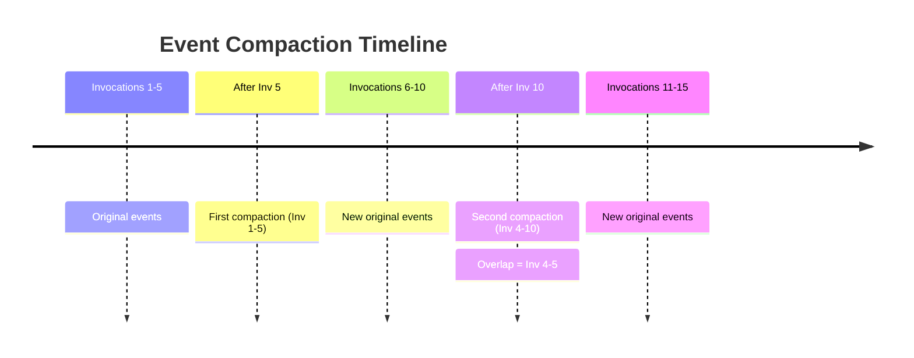

import { Callout } from 'fumadocs-ui/components/callout';
import { Tab, Tabs } from 'fumadocs-ui/components/tabs';
import { Step, Steps } from 'fumadocs-ui/components/steps';

Event Compaction automatically manages long conversation histories by periodically replacing ranges of events with LLM-generated summaries. This keeps context windows manageable while preserving important information.

## Overview

As conversations grow longer, sending the full history to the LLM becomes inefficient and costly. Event Compaction solves this by:

- **Reducing token usage** through concise summaries
- **Improving performance** with smaller context windows
- **Maintaining context** by preserving key information
- **Operating transparently** without code changes

<Callout type="info">
Event Compaction uses a sliding window algorithm that triggers after a configured number of new invocations, ensuring consistent behavior and predictable costs.
</Callout>

## How It Works

### The Compaction Process

<Steps>

<Step>
### Trigger Condition
After each agent turn completes, ADK checks if enough new invocations have occurred since the last compaction.
</Step>

<Step>
### Window Selection
When triggered, ADK selects a window of invocations to compact, including some overlap from the previous compaction for continuity.
</Step>

<Step>
### Summarization
The selected events are sent to an LLM (by default, the agent's own model) to generate a concise summary.
</Step>

<Step>
### Storage
The summary is stored as a special compaction event with `actions.compaction` containing the timestamp range and summarized content.
</Step>

<Step>
### Consumption
When building LLM requests, compaction events are converted to normal model events and original covered events are filtered out.
</Step>

</Steps>

### Sliding Window Algorithm



The algorithm maintains continuity by including overlap from the previous range, ensuring no context is lost between compactions.

## Configuration

### Basic Setup

<Tabs items={['AgentBuilder', 'Runner Config', 'Custom Summarizer']}>
<Tab value="AgentBuilder">

```typescript
import { AgentBuilder } from '@iqai/adk';

// Simple usage with AgentBuilder
const { runner } = await AgentBuilder
  .create('assistant')
  .withModel('gemini-2.5-flash')
  .withEventsCompaction({
    compactionInterval: 10,  // Compact every 10 invocations
    overlapSize: 2,          // Include 2 prior invocations
  })
  .build();

// Now compaction happens automatically
const response = await runner.ask('Hello!');
```

</Tab>
<Tab value="Runner Config">

```typescript
import { Runner, EventsCompactionConfig } from '@iqai/adk';

const compactionConfig: EventsCompactionConfig = {
  // Trigger compaction every 10 new invocations
  compactionInterval: 10,
  
  // Include 2 prior invocations for continuity
  overlapSize: 2,
};

const runner = new Runner({
  appName: 'MyApp',
  agent: myAgent,
  sessionService: mySessionService,
  eventsCompactionConfig: compactionConfig,
});
```

</Tab>
<Tab value="Custom Summarizer">

```typescript
import { 
  EventsSummarizer, 
  Event, 
  EventActions,
  LlmEventSummarizer 
} from '@iqai/adk';

// Option 1: Use default with custom model
const customModel = LLMRegistry.newLLM('gpt-4o-mini');
const summarizer = new LlmEventSummarizer(customModel);

// Option 2: Implement custom logic
class CustomSummarizer implements EventsSummarizer {
  async maybeSummarizeEvents(events: Event[]): Promise<Event | undefined> {
    // Your custom summarization logic
    const summary = await this.generateSummary(events);
    
    if (!summary) return undefined;
    
    return new Event({
      invocationId: Event.newId(),
      author: 'user',
      actions: new EventActions({
        compaction: {
          startTimestamp: events[0].timestamp,
          endTimestamp: events[events.length - 1].timestamp,
          compactedContent: {
            role: 'model',
            parts: [{ text: summary }],
          },
        },
      }),
    });
  }
}

const compactionConfig: EventsCompactionConfig = {
  summarizer: new CustomSummarizer(),
  compactionInterval: 10,
  overlapSize: 2,
};
```

</Tab>
</Tabs>

### Configuration Options

| Option | Type | Default | Description |
|--------|------|---------|-------------|
| `compactionInterval` | `number` | Required | Number of new invocations needed to trigger compaction |
| `overlapSize` | `number` | Required | Number of prior invocations to include for continuity |
| `summarizer` | `EventsSummarizer` | Auto-created | Custom summarizer (defaults to LLM-based) |

<Callout type="warn">
Choose your `compactionInterval` based on your use case:
- **Higher values (20+)**: Less frequent compaction, more detailed history retained
- **Lower values (5-10)**: More aggressive compaction, better for very long sessions
</Callout>

## Understanding the Components

### EventCompaction Interface

The compaction data structure that's stored in event actions:

```typescript
interface EventCompaction {
  startTimestamp: number;     // Start of compacted range
  endTimestamp: number;       // End of compacted range
  compactedContent: Content;  // The summarized content
}
```

### EventsSummarizer Interface

The interface for custom summarizers:

```typescript
interface EventsSummarizer {
  maybeSummarizeEvents(events: Event[]): Promise<Event | undefined>;
}
```

### LlmEventSummarizer

The default implementation that uses an LLM to generate summaries:

```typescript
import { LlmEventSummarizer } from '@iqai/adk';

// Use with custom prompt
const summarizer = new LlmEventSummarizer(
  myModel,
  `Summarize these conversation events focusing on:
  - Key decisions made
  - Important information exchanged
  - Action items identified
  
  Events: {events}`
);
```

## Examples

### Basic Usage with AgentBuilder

```typescript
import { AgentBuilder } from '@iqai/adk';

// Create agent with compaction using AgentBuilder
const { runner } = await AgentBuilder
  .create('assistant')
  .withModel('gemini-2.5-flash')
  .withInstruction('You are a helpful assistant.')
  .withEventsCompaction({
    compactionInterval: 5,
    overlapSize: 1,
  })
  .build();

// Use normally - compaction happens automatically
const response = await runner.ask('Hello!');
console.log(response);
```

### Basic Usage with Runner

```typescript
import { InMemoryRunner, LlmAgent } from '@iqai/adk';

const agent = new LlmAgent({
  name: 'Assistant',
  model: 'gemini-2.5-flash',
  instruction: 'You are a helpful assistant.',
});

const runner = new InMemoryRunner(agent, {
  appName: 'ChatApp',
});

// Enable compaction
runner.eventsCompactionConfig = {
  compactionInterval: 5,
  overlapSize: 1,
};

// Use normally - compaction happens automatically
for await (const event of runner.runAsync({
  userId: 'user123',
  sessionId: 'session456',
  newMessage: { role: 'user', parts: [{ text: 'Hello!' }] },
})) {
  console.log(event);
}
```

### Checking Compaction Status

```typescript
// Check if a session has compacted events
function hasCompactions(session: Session): boolean {
  return session.events.some(event => event.actions?.compaction);
}

// Get compaction statistics
function getCompactionStats(session: Session) {
  const compactions = session.events.filter(e => e.actions?.compaction);
  
  return {
    totalCompactions: compactions.length,
    totalEventsCompacted: compactions.reduce((sum, e) => {
      const compact = e.actions.compaction!;
      const covered = session.events.filter(
        ev => ev.timestamp >= compact.startTimestamp 
           && ev.timestamp <= compact.endTimestamp
      );
      return sum + covered.length;
    }, 0),
  };
}
```

### Custom Summarization Strategy

```typescript
class BulletPointSummarizer implements EventsSummarizer {
  constructor(private model: BaseLlm) {}
  
  async maybeSummarizeEvents(events: Event[]): Promise<Event | undefined> {
    if (events.length < 3) return undefined; // Skip small batches
    
    const eventTexts = events
      .filter(e => e.content?.parts?.[0]?.text)
      .map(e => `${e.author}: ${e.content.parts[0].text}`);
    
    const prompt = `Create a bullet-point summary of this conversation:

${eventTexts.join('\n')}

Format as:
• Key point 1
• Key point 2
• Key point 3`;

    let summary = '';
    for await (const response of this.model.generateContentAsync({
      contents: [{ role: 'user', parts: [{ text: prompt }] }],
    } as any)) {
      summary += response.content?.parts
        ?.map(p => p.text || '')
        .join('');
    }
    
    return new Event({
      invocationId: Event.newId(),
      author: 'user',
      actions: new EventActions({
        compaction: {
          startTimestamp: events[0].timestamp,
          endTimestamp: events[events.length - 1].timestamp,
          compactedContent: {
            role: 'model',
            parts: [{ text: summary.trim() }],
          },
        },
      }),
    });
  }
}
```

## Best Practices

### Choosing Compaction Interval

```typescript
// For customer support (high detail retention)
const supportConfig: EventsCompactionConfig = {
  compactionInterval: 20,  // Compact less frequently
  overlapSize: 5,          // More overlap
};

// For general chat (aggressive compaction)
const chatConfig: EventsCompactionConfig = {
  compactionInterval: 5,   // Compact frequently
  overlapSize: 1,          // Minimal overlap
};

// For long research sessions (balanced)
const researchConfig: EventsCompactionConfig = {
  compactionInterval: 10,  // Moderate compaction
  overlapSize: 2,          // Standard overlap
};
```

### Monitoring Compaction

```typescript
class CompactionMonitor {
  private compactionCount = 0;
  private eventsCompacted = 0;
  
  async runWithMonitoring(runner: Runner, query: string) {
    const sessionBefore = await runner.sessionService.getSession(...);
    
    // Run agent
    for await (const event of runner.runAsync(...)) {
      if (event.actions?.compaction) {
        this.compactionCount++;
        console.log('Compaction occurred:', {
          range: [
            event.actions.compaction.startTimestamp,
            event.actions.compaction.endTimestamp,
          ],
          summary: event.actions.compaction.compactedContent,
        });
      }
    }
    
    const sessionAfter = await runner.sessionService.getSession(...);
    console.log('Session stats:', {
      totalEvents: sessionAfter.events.length,
      compactions: this.compactionCount,
    });
  }
}
```

### Testing with Compaction

```typescript
import { describe, it, expect } from 'vitest';

describe('Agent with Compaction', () => {
  it('should compact after threshold', async () => {
    const runner = new InMemoryRunner(agent, {
      appName: 'TestApp',
    });
    
    runner.eventsCompactionConfig = {
      compactionInterval: 3,
      overlapSize: 1,
    };
    
    // Generate 3 invocations
    for (let i = 0; i < 3; i++) {
      for await (const event of runner.runAsync({
        userId: 'test',
        sessionId: 'test',
        newMessage: { role: 'user', parts: [{ text: `Message ${i}` }] },
      })) {
        // Process events
      }
    }
    
    const session = await runner.sessionService.getSession('TestApp', 'test', 'test');
    const hasCompaction = session?.events.some(e => e.actions?.compaction);
    
    expect(hasCompaction).toBe(true);
  });
});
```

## Performance Considerations

### Token Savings

Event compaction can significantly reduce token usage:

```typescript
// Example: 10 invocations with 200 tokens each = 2000 tokens
// After compaction: 1 summary (300 tokens) + 5 recent (1000 tokens) = 1300 tokens
// Savings: 35%
```

### Latency Impact

- **First compaction**: Adds summarization latency (~1-2s)
- **Subsequent requests**: Faster due to smaller context
- **Net effect**: Improved performance for long sessions

### Cost Optimization

```typescript
// Use cheaper model for summarization
import { LlmEventSummarizer, LLMRegistry } from '@iqai/adk';

const cheapModel = LLMRegistry.newLLM('gemini-2.0-flash-lite');
const costEffectiveSummarizer = new LlmEventSummarizer(cheapModel);

const config: EventsCompactionConfig = {
  summarizer: costEffectiveSummarizer,
  compactionInterval: 8,
  overlapSize: 2,
};
```

## Troubleshooting

### Compaction Not Triggering

<Callout type="error">
If compaction isn't occurring, check:
1. `eventsCompactionConfig` is set on the Runner
2. `compactionInterval` threshold has been reached
3. Summarizer is properly configured
4. Session has enough invocations
</Callout>

```typescript
// Debug compaction
runner.eventsCompactionConfig = {
  compactionInterval: 2, // Lower threshold for testing
  overlapSize: 1,
};

// Check after each invocation
const session = await runner.sessionService.getSession(...);
console.log('Invocation count:', new Set(
  session.events.map(e => e.invocationId)
).size);
console.log('Has compaction:', session.events.some(
  e => e.actions?.compaction
));
```

### Summary Quality Issues

```typescript
// Improve summary quality with custom prompt
const detailedSummarizer = new LlmEventSummarizer(
  model,
  `You are summarizing a conversation for context retention.

Include:
- All important facts, decisions, and conclusions
- Named entities and specific details
- User preferences and requirements
- Open questions or unresolved issues

Exclude:
- Greetings and pleasantries
- Redundant information
- Off-topic tangents

Events to summarize:
{events}

Provide a detailed yet concise summary:`
);
```

## Advanced Topics

### Compaction in Multi-Agent Systems

```typescript
// Compaction works with agent hierarchies
const rootAgent = new LlmAgent({
  name: 'Coordinator',
  model: 'gemini-2.5-pro',
  subAgents: [assistantAgent, researchAgent],
});

const runner = new Runner({
  agent: rootAgent,
  sessionService: mySessionService,
  eventsCompactionConfig: {
    compactionInterval: 10,
    overlapSize: 2,
  },
});

// All agent events are compacted together
```

### Selective Compaction

```typescript
// Only compact certain event types
class SelectiveSummarizer implements EventsSummarizer {
  async maybeSummarizeEvents(events: Event[]): Promise<Event | undefined> {
    // Filter events to compact
    const textEvents = events.filter(e => 
      e.content?.parts?.some(p => p.text) &&
      !e.actions?.stateDelta // Preserve state changes
    );
    
    if (textEvents.length < 5) return undefined;
    
    // Summarize only text events
    // ... implementation
  }
}
```

## Related Topics

- [Event Actions](/docs/framework/events/event-actions) - Understanding event metadata and control flow
- [Sessions](/docs/framework/sessions/session) - Managing conversation state
- [Memory](/docs/framework/sessions/memory) - Long-term storage patterns
- [Run Config](/docs/framework/runtime/run-config) - Runner configuration options

Event Compaction is a powerful feature for managing long-running conversations efficiently. Start with the defaults and tune based on your specific use case and performance requirements.
