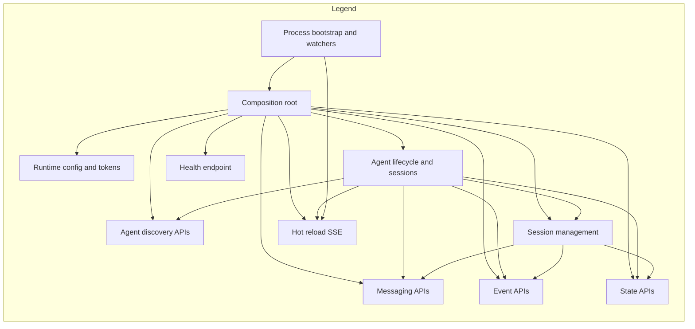

# ADK CLI HTTP Layer Architecture

**This document is for contributors working on the ADK CLI HTTP layer.** If you're looking to use the CLI, visit the [live documentation](https://adk.iqai.com/docs/cli).

This document maps the responsibilities and interactions of the HTTP layer located at `packages/adk-cli/src/http/`.

## High-level overview

- **Composition root**: `http.module.ts` wires all feature modules
- **Bootstrap**: `startHttpServer()` creates and configures the NestJS application, scans agents, and initializes hot reload
- **Runtime configuration**: `runtime-config.ts` defines the shape of configuration provided via `ConfigModule.register()`
- **Core providers**: agent discovery, loading, and lifecycle are centralized in `providers/`
- **Feature areas**: discovery, messaging, sessions, events, state, reload, and health each provide focused controllers and services

## Contributing to the HTTP Layer

### Adding New Endpoints

1. **Create a new module** in the appropriate feature folder or create a new one:

   ```bash
   mkdir src/http/my-feature
   touch src/http/my-feature/my-feature.{module,controller,service}.ts
   ```

2. **Follow NestJS patterns**:
   - Use dependency injection for services
   - Implement proper DTOs for request/response validation
   - Add appropriate decorators for OpenAPI documentation

3. **Register the module** in `http.module.ts`:

   ```typescript
   @Module({
     imports: [
       // ... existing modules
       MyFeatureModule,
     ],
   })
   ```

### Extending Existing Modules

- **Controllers**: Add new routes following REST conventions
- **Services**: Inject `AgentManager` for agent operations, `SessionsService` for session management
- **DTOs**: Define request/response schemas in the `dto/` folder
- **Testing**: Add unit tests for services and integration tests for controllers

### Common Patterns

- **Agent Operations**: Always use `AgentManager` for agent lifecycle management
- **Session Management**: Use `SessionsService` for session operations
- **Error Handling**: Use NestJS exception filters and proper HTTP status codes
- **Validation**: Use class-validator decorators in DTOs
- **Documentation**: Add Swagger decorators for API documentation

### Testing HTTP Layer Changes

```bash
# Run unit tests
pnpm test

# Run HTTP-specific tests
pnpm test http

# Manual testing with the CLI
pnpm build
npm link
adk serve --swagger
```

## Module composition

`HttpModule.register()` imports:

- `ConfigModule` - Runtime configuration and DI tokens
- `ProvidersModule` - Core agent management services
- `DiscoveryModule` - Agent discovery endpoints
- `MessagingModule` - Message handling
- `SessionsModule` - Session management
- `EventsModule` - Event streaming
- `StateModule` - State management
- `ReloadModule` - Hot reload functionality
- `HealthModule` - Health check endpoint

---

## Folder responsibilities

### config/

**Purpose**: Provide runtime configuration and DI tokens to the entire HTTP layer.

**Key pieces**:

- `ConfigModule.register()` exposes:
  - `RUNTIME_CONFIG` value
  - Agents directory token (from `TOKENS.AGENTS_DIR`)
  - Quiet flag token (from `TOKENS.QUIET`)

**Contributing**: Modify this when adding new CLI configuration options.

### providers/

**Purpose**: Core infrastructure for agent lifecycle: scanning, loading, running, and session plumbing.

**Key services**:

- **`AgentScanner`** - Recursively discovers agent folders by locating agent.ts or agent.js files
  - `scanAgents()` returns a Map of discovered agents with names and paths
  - **Contributing**: Extend file discovery patterns or add new agent file conventions

- **`AgentLoader`** - Loads agent modules and resolves diverse export patterns
  - `importTypeScriptFile()` compiles TypeScript agents on the fly via esbuild
  - `loadEnvironmentVariables()` preloads env files in priority order
  - `resolveAgentExport()` robustly resolves BaseAgent from many export styles
  - **Contributing**: Add support for new agent export patterns or improve TypeScript compilation

- **`AgentManager`** - Orchestrates scanning, booting, messaging, and lifecycle management
  - `scanAgents()` populates the in-memory agents registry
  - `startAgent()` dynamically loads and boots an agent
  - `sendMessageToAgent()` streams messages to agents and aggregates output
  - **Contributing**: Extend agent lifecycle hooks or improve message handling

**Also provided**: In-memory session storage via `InMemorySessionService` binding from `@iqai/adk`.

### discovery/

**Purpose**: List available agents and trigger re-scan.

**HTTP surface**:

- `GET /api/agents` → list discovered agents
- `POST /api/agents/refresh` → rescan current directory and return updated list

**Contributing**: Add agent metadata, filtering, or search capabilities.

### messaging/

**Purpose**: Read messages for active sessions and send new user messages with optional attachments.

**Components**:

- `MessagingController` - HTTP routes for message operations
- `MessagingService` - Business logic for message handling

**Contributing**:

- Add support for different message types (images, files, etc.)
- Implement message streaming for real-time responses
- Add message validation or filtering

### sessions/

**Purpose**: Manage agent sessions: list, create, delete, switch, and translate raw session data into API responses.

**Key operations**:

- Session CRUD operations
- Session switching for multi-conversation support
- State management integration

**Contributing**:

- Add session persistence beyond in-memory storage
- Implement session search or filtering
- Add session metadata or tagging

### events/

**Purpose**: Fetch event history for specific sessions.

**Contributing**: Add event filtering, pagination, or real-time event streaming.

### state/

**Purpose**: Read and mutate session-scoped state with minimal API.

**Contributing**: Add state validation, versioning, or conflict resolution.

### reload/

**Purpose**: Server-sent events for hot-reload notifications and file watching integration.

**Components**:

- `ReloadController` - SSE endpoint for web clients
- `HotReloadService` - Manages SSE clients and broadcasts reload events

**Contributing**:

- Improve file watching performance
- Add selective reload based on file types
- Implement reload confirmation or status feedback

### health/

**Purpose**: Basic liveness probe.

**Contributing**: Add health checks for dependencies, disk space, or agent status.

---

## Bootstrap and runtime wiring

**`startHttpServer()`**:

- Creates NestJS app with `HttpModule.register()`
- Enables CORS for development
- Triggers initial agent scanning
- Configures hot reload watchers

**`RuntimeConfig` fields**:

- `host`, `port` - server bind target
- `agentsDir` - root directory to scan
- `quiet` - reduce logging verbosity
- `hotReload?` - enable/disable watchers
- `watchPaths?` - additional directories to watch

**Contributing**: Extend `RuntimeConfig` when adding new CLI options or server configuration.

---

## Debugging Tips for Contributors

### Development Environment Setup

```bash
# Enable detailed logging for development
export ADK_DEBUG=true
export ADK_VERBOSE=true

# Run with debug output
adk serve --verbose
```

### Useful Development Commands

```bash
# Watch mode for development
pnpm dev

# Test specific HTTP modules
pnpm test providers
pnpm test sessions

# Build and test CLI integration
pnpm build && npm link && adk serve --swagger
```

### Common Contributor Issues

1. **Module registration errors**: Verify imports and dependency injection setup in NestJS modules
2. **Test failures during development**: Check mock setups and async handling in test files
3. **TypeScript compilation errors**: Ensure proper typing and module resolution in source code
4. **HTTP endpoint issues**: Verify controller registration and route definitions

---

## API surface summary

- `GET /health` - Health check
- `GET /api/agents` - List agents
- `POST /api/agents/refresh` - Refresh agent list
- `GET /api/agents/:id/messages` - Get message history
- `POST /api/agents/:id/message` - Send message to agent
- `GET /api/agents/:id/sessions` - List sessions
- `POST /api/agents/:id/sessions` - Create session
- `DELETE /api/agents/:id/sessions/:sessionId` - Delete session
- `POST /api/agents/:id/sessions/:sessionId/switch` - Switch active session
- `GET /api/agents/:id/sessions/:sessionId/events` - Get session events
- `GET /api/agents/:id/sessions/:sessionId/state` - Get session state
- `PUT /api/agents/:id/sessions/:sessionId/state` - Update session state
- `GET /reload/stream` - Hot reload SSE stream

---

## Operational notes

- **Hot reload**: Filters file changes using .gitignore-aware prefixes and skips build directories
- **Session persistence**: Uses in-memory storage via `@iqai/adk`'s `InMemorySessionService`
- **Message streaming**: Aggregates chunked output into simple response strings
- **Module dependencies**: All feature modules depend on `ProvidersModule` for consistent access

---

## Architecture diagram



---

**For more information about contributing to the ADK CLI, see the [main README](../README.md#contributing).**
